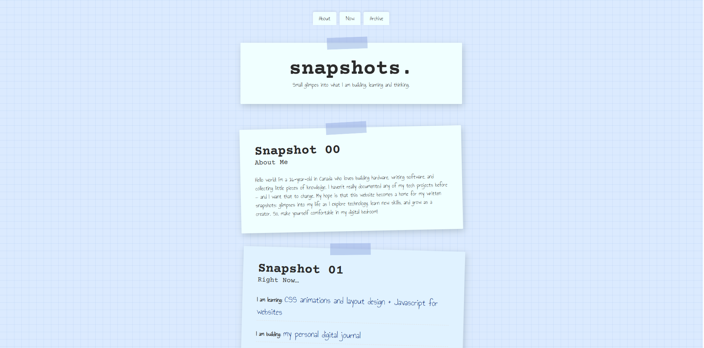

# Written Snapshots - My Digital Scrapbook Journal
This is a simple personalized site I made as a submission to [HackClub's Stardance Challenge](https://stardance.hackclub.com/missions/personal-page/guide) by following thier Personal Site mission and guide. It is also the result of a self-inflicted challenge to complete a website in a single evening. I am glad I did this though as I do believe this is the first site I have completely made from scratch that I have actually finished. I am pleased with how it turned out and the experience I gained in html and css by doing this. I hope to update this website regularly to log my growth as I learn more about electronics and software.

You can see the website for yourself [here](https://github.com/ReuTheCoder/a-written-snapshot). 

## Site Features
My website has 3 sections:
- **About me:** A brief introduction about me
- **Now:** My most recent update detailing my current interests and explorations
- **Archive:** Past journal logs on anything I choose to write about. This section will grow as the website recieve more logs.

Design wise, it features a graph paper canvas (dyed my favorite color) with a scrapbook theme achieved by "taping" papers to the webpage and rotating them (along with a few other jornal elements) for an organic, messy look. Additionally, it uses two google fonts: *Courier Prime* and *Annie Use Your Telescope* to give my website an evn more "handmade" look.

## Built With:
- **HTML:** for the text layout and contents
- **CSS** for the visual elements that styled scrapbook theme
I used GitHub's codespace, linked up with VSCode, to do most of the coding for this project.

## AI Use

I tried my best to avoid AI whenever possible. All core concepts, structural planning, layout choice, and code deployment were designed and managed completely by me. However, I did use Google's Gemini for aid in drafting my CSS blueprint by asking for the specific CSS syntax to achieve a desired look. Additionally, I used some of its suggestions when researching the website's fonts and color palette on Google Search. Instead of asking AI to build entire sections of my project, I only used it to clarify specific syntax questions and then worked through the implementation on my own. Only one specific element was heavily influenced by the AI, the CSS Paperclip. Without a doubt, less than 30% of my project used AI.

## Possible Future Updates
- Changing font choice: My sister gave me feedback saying that my body font, Annie Use Your Telescope" was a bit hard to read
- Adding more scapbook elements: Fills up the empty margin space and intensifies the digital scapbook feel of the website
- Adding more logs as time passes

